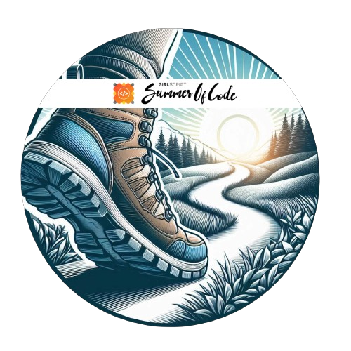

<h1 align="center"> Yo!!! I'm Sk Mirajul Islam 
</h1>

    
    
        

    <b>
 Coding is my love language :) 
</b>
    
     
    
<strong>"🎓 College. ☕️ Coffee. 💻 Code. Repeat."   Vibing to: 🎧</strong>

    <!-- Streak feature -->
    

    
    
    
    
    

 

    <!-- GitHub Trophies -->
    

 

    <table>
        <tr>
            <td><strong>Programming Languages</strong></td>
            <td></td>
        </tr>
        <tr>
            <td><strong>Database Technologies</strong></td>
            <td></td>
        </tr>
        <tr>
            <td><strong>Frontend Development</strong></td>
            <td></td>
        </tr>
        <tr>
            <td><strong>Backend Development</strong></td>
            <td></td>
        </tr>
        <tr>
            <td><strong>Frameworks</strong></td>
            <td></td>
        </tr>
        <tr>
            <td><strong>Developer Tools</strong></td>
            <td>
            </td>
        </tr>
    </table>

 

<h2 style="display: flex; justify-content: center; flex-wrap: wrap; gap: 20px; margin-top: 20px;">- : Open Source
    Programs & Achievements : -</h2>

    <table>
        <tr align="center">
            <td style="border-right: 1px solid #dddddd; padding: 15px;" valign="top" width="50%">
                <a href="">
                    
                     
                    <strong>GirlScript Summer of Code</strong>
                </a>
                 
                🎓 Project Mentor
                 
                
                    I am one of 200 mentors among 17,000+ participants in GSSOC. 
                    PRs Merged: 30+ 
                    Total Badges: 4 
                    Total Score: 2000 
                
            </td>
            <td style="padding: 15px;" valign="top" width="50%">
                <table>
                    <tr align="center">
                        <td style="border-right: 1px solid #dddddd; padding: 10px;" width="100">
                            
                             
                            <strong>Explorer Badge</strong>
                        </td>
                        <td style="border-right: 1px solid #dddddd; padding: 10px;" width="100">
                            
                             
                            <strong>Adventurer Badge</strong>
                        </td>
                        <td style="padding: 10px;" width="100">
                            
                             
                            <strong>Trailblazer Badge</strong>
                        </td>
                        <td style="border-right: 1px solid #dddddd; padding: 10px;" width="100">
                            
                             
                            <strong>Summit Seeker Badge</strong>
                        </td>
                    </tr>
                    <tr align="center">
                        <td style="border-right: 1px solid #dddddd; padding: 10px;" width="100">
                            
                             
                            <strong>Hacktoberfest 2022</strong>
                        </td>
                        <td style="border-right: 1px solid #dddddd; padding: 10px;" width="100">
                            
                             
                            <strong>Cloud Innovator Badge</strong>
                        </td>
                        <td style="border-right: 1px solid #dddddd; padding: 10px;" width="100">
                            
                             
                            <strong>100 days LeetCode badge</strong>
                        </td>
                        <td style="padding: 10px;" width="100">
                            
                             
                            <strong>API Student Expert</strong>
                             
                            Postman
                        </td>
                    </tr>
                </table>
            </td>
        </tr>
    </table>

 
<!-- Connect with Me Section -->
<h2 style="text-align: center;">- : Connect with Me : -</h2>

    
    
    
    
    
    

